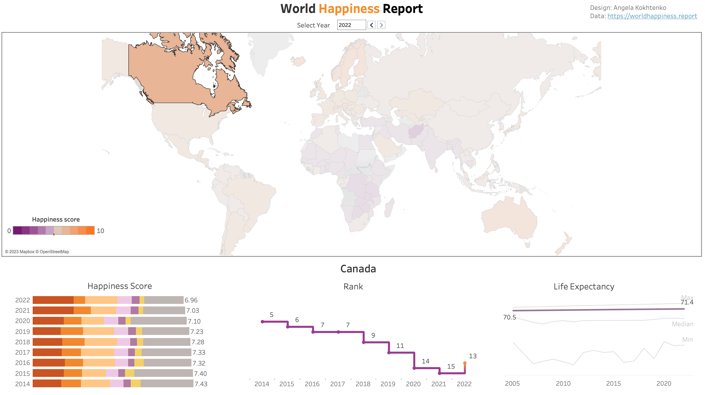
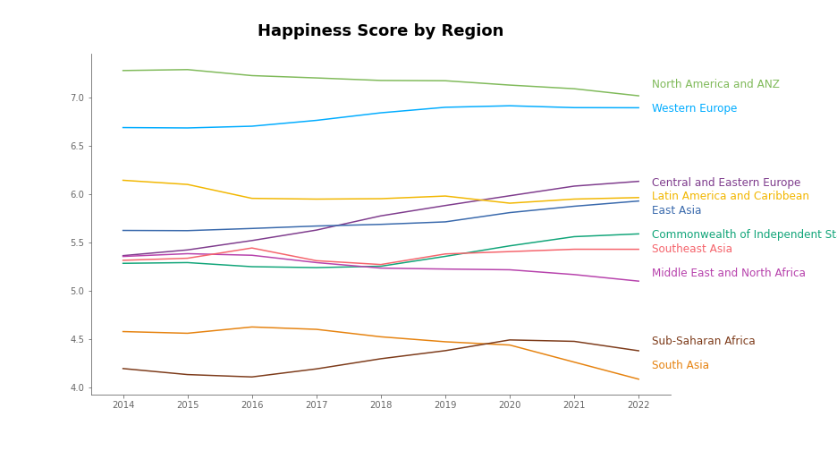
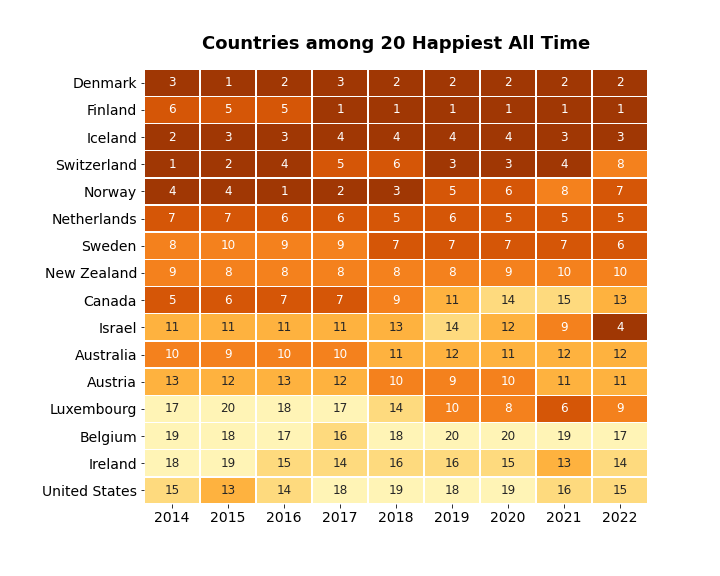
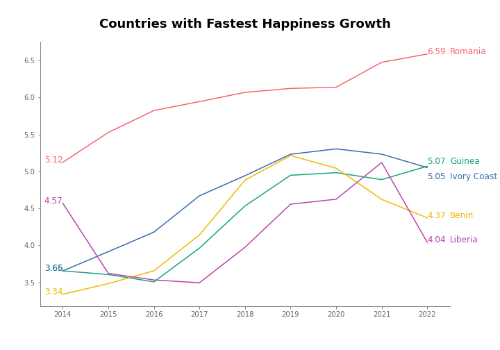
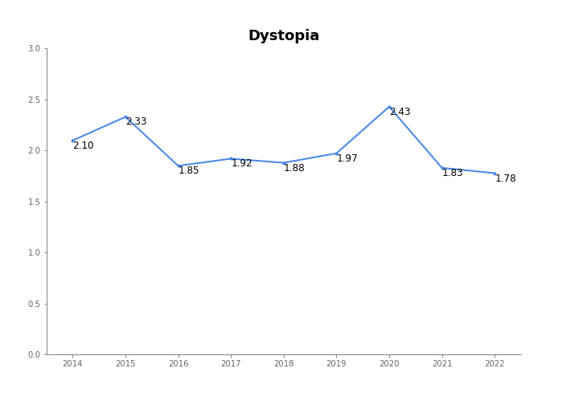

# World Happiness Report
In this project I’ve analyzed [data](Source%20Data/) reported by [World Happiness Report](https://worldhappiness.report/) for the period 2015-2021.

## Tools used

- Python 3.8 (pandas, matplotlib, seaborn, numpy, io, requests)

- Tableau Public

## Data cleaning

As the data is split by year, I have to load each file separately and standardize them before unifying them all together. I generated two separate columns for residual and dystopia to support further analysis. Finally, I joined the region data to the primary table.

## Visualization

I exported clean data and used it as a data source for [Tableau dashboard](https://public.tableau.com/app/profile/angela6018/viz/WorldHappinessReport_16712100316400/WorldHappiness).

Additionally, I have created several charts using the matplotlib and seaborn libraries:

Find more plots in [notebook](Clean_data.ipynb).

## Analysis

- The most happy country is Finland. However, even  happiest countries don't reach 8 at Happiness Score.

- The least happy country is Afghanistan. Only 2 countries have happiness score less than 3.00: Lebanon and Afghanistan.

- North America, Australia, New Zeland and Western Europe are happier regions. Central and Eastern Europe became significantly happier for the last 8 years.

- Denmark has the highest average happiness score during 2014-2021 period.

- Australia and Canada were replaced by Austria and Luxemburg in top 10 happiest countries.

- Romania has the fastest growth in happiness from 5.12 in 2014 year to 6.48 in 2021.

- Afghanistan has the fastest drop in happiness from 3.58 in 2014 to 2.40 in 2021.

- In 2021 Dystopia has the lowest value that means some of key factors became even lower than they were in previous years.
